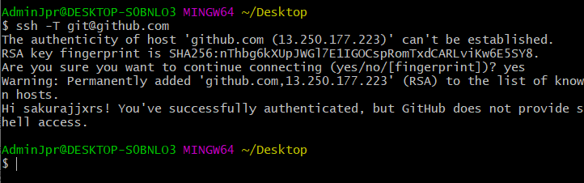

# Git概念

版本控制软件

分布式版本控制软件

## 命令

```

git add  	--将本地文件增加到暂存区
git commit  --将暂存区的内容 提交到 本地仓库
git push  	--将本地仓库的内容 推送到 远程仓库
git pull	--将远程仓库的内容 拉取到 本地仓库
```

仓库严格意义上时分支 分支默认的时master

## 安装

[Git的Windows下载网址](https://gitforwindows.org/)（有墙可能会下载失败而且下载跟慢）

[git for windows国内镜像](http://npm.taobao.org/mirrors/git-for-windows/)（谁用谁知到） 

安装时选:Use Git form Git Bash only 其他默认下一步

## 配置path

在path中设置Git的bin目录     D:\Git\bin

## 配置Git

任意地方右键选择  Git Bash Here

配置本地的用户名，邮箱

```
配置用户名:  git config --global user.name "adminjpr"
配置邮箱:   git config --global user.email "1063028176@qq.com"
```

查看     C:\Users\AdminJpr\.gitconfig

## 搭建git服务器（远程仓库）

[统一的托管网站GitHub](https://github.com/)

## 免密钥登录（ssh key）

为了 在本地 和 远程仓库之间进行免密钥登录

### 先在本地生成ssh

打开 Git Bash Here

输入命令行

```
ssh-keygen -t rsa -C 1063028176@qq.com
```


### 发送给远程

github 点击 settings 中 找SSH and GPG keys

 选New SSH key


Title：随便起

key中输入刚才在本地生成的


注意：复制到远程时注意复制时的回车不用

### 测试连通性

```
ssh -T git@github.com
```



此时再查看C:\Users\AdminJpr\.ssh


你会看到多出了know_hosts文件

## 具体案例

### 准备

再本地新建一个git项目

在项目根目录 右键 Git Bash Here  输入

```
git init
```


在远程建立git项目

new —— 建立项目 —— 生成唯一标识符 git@github.com:sakurajjxrs/mygitremote.git

本地项目--远程项目关联

```
git remote add origin git@github.com:sakurajjxrs/mygitremote.git
```

### 项目的交互

#### 第一次发布项目（本地 --> 远程）

```
git add .        //第一步：将本地的文件放到暂存区
git commit -m "注释内容"  //第二步：暂存区-->本地分支（默认master）
git push -u origin master  //第三步
```

#### 第一次下载项目（远程 --> 本地）

```
git clone git@github.com:sakurajjxrs/mygitremote.git
```

#### 提交（本地-->远程）

```
git add .
git commit -m "提交到分支"
git push origin master
```

#### 更新（远程 --> 本地）

```
git pull
```
