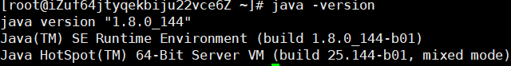
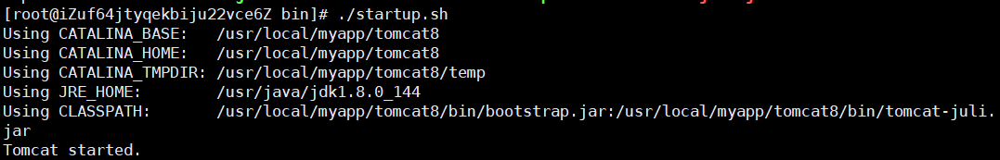

# CentOS7.3下的tomcat安装

## JDK环境搭建

### 安装包导入

将安装包通过Xftp导入 /usr/java目录下

### 解压文件

tar -zxvf jdk+tab键自动补全；回车解压

### 配置环境变量

输入命令：

```
vi /etc/profile
```

在最后添加代码

```
export JAVA_HOME=/usr/java/jdk1.8.0_144
export CLASSPATH=$:CLASSPATH:$JAVA_HOME/lib
export PATH=$PATH:$JAVA_HOME/bin
```

保存并退出：wq!

配置操作：

```
source /etc/profile
```

检验是否配置成功：

```
java -version
```

当出现下图信息时说明jdk配置成功了



## tomcat安装

### 安装包导入

先在/usr/local目录下创建一个myapp文件夹

```
mkdir myapp
```

将安装包通过Xftp导入 /usr/local/myapp目录下

### 解压文件

tar -zxvf jdk+tab键自动补全；回车解压

为了方便以后的操做现在先将解压后的包名修改一下,改成tomcat8

```
mv apache-tomcat-8.5.51 tomcat8
```

### 启动tomcat

进入到 /usr/local/myapp/tomcat8/bin下，用ls命令查看目录


启动tomcat

```
./startup.sh
```



可以看出tomcat已经启动了

现在用 http：//ip:8080 登录一下

此时遇到了问题，登录不上去了


### tomcat成功启动但是无法访问的问题

#### 检查防火墙

- 首先CentOS 7.0版本以后默认使用的是firewall作为防火墙

- 查看防火墙状态

  ```
  systemctl status firewalld || firewall-cmd --state
  ```

  

- 开启防火墙

  ```
  systemctl start firewalld
  ```

​        这个过程没有任何提示

- 设置防火墙开机自启

  ```
  systemctl enable firewalld
  ```

- 重启防火墙

  ```
  systemctl restart firewalld
  ```

   这个过程没有任何提示

- 查看开放的端口

  ```
  netstat -ntlp
  ```

- 尝试开启8080端口

  ```
  firewall-cmd --zone=public --add-port=8080/tcp --permanent
  ```

- 重启防火墙

  ```
  systemctl restart firewalld
  ```

- 重启tomcat

  ```
  ./shutdown.sh
  ./startup.sh
  ```

- 此时在在浏览器运行

  还是失败

- 此时我们就应该考虑其他的因素了

#### 检查tomcat配置文件

##### 转折点

想到这一点是因为我在阿里云自带的远程控制中心运行tomcat时报错了

在SecureCRT和Xshell上运行时都时显示的tomcat start


从错误中我们可以看到这个问题出现在 JAVA_HOME 和 JAVA_JRE上面

[参考自这篇文章](https://blog.csdn.net/to_baidu/article/details/52848620)

##### 原因：

因为启动tomcat会调用tomcat安装文件中的startup.bat，而它调用了catalina.bat则调用了setclasspath.bat。因此需要在setclasspath.bat的开头手动声明环境变量。

##### 解决方案：

打开tomcat的bin目录下的**setclasspath.sh**，**添加JAVA_HOME和JRE_HOME两个环境变量**

```
export JAVA_HOME=/usr/java/jdk1.8.0_144
export JRE_HOME=/usr/java/jdk1.8.0_144/jre
```

windows下将export改为set即可

保存并退出

一般来说是可以成功的

##### 解决方案：

在jdk的配置后面加上如下：

```
export TOMCAT_HOME=/usr/local/myapp/tomcat8
export CATALINA_HOME=/usr/local/myapp/tomcat8
```

一般来说是也是可以成功的

##### 新错误：

重启出错


解决：

Linux下强制杀死Tomcat进程

先查看tomcat的进程号

```
ps -ef|grep tomcat
```


利用kill杀死进程

```
kill -9 XXXXX
```

再用查看进程指令查看是否还有残留

然后再次启动

