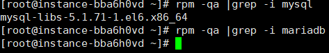
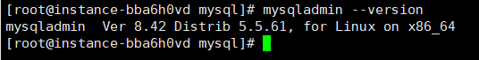
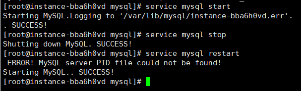
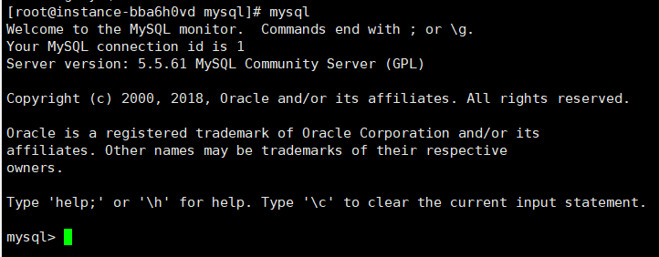
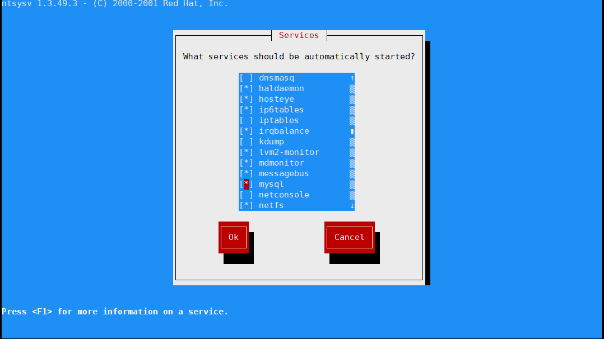
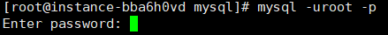
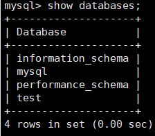

# mysql的安装详细教程

## 安装包的下载

前提 本人使用的是rpm安装

下载地址[华为镜像网站](https://repo.huaweicloud.com/mysql/Downloads/MySQL-5.5/)

下载两个安装包:	MySQL-client-5.5.61-1.el6.x86_64.rpm

​								MySQL-server-5.5.61-1.el6.x86_64.rpm

用Xftp上传到服务器上

## 安装前的检查

安装之前先检查一下有没有其他的数据库

```
rpm -qa |grep -i mysql
rpm -qa |grep -i mariadb //centos7默认系统自带的
```

我的是CentOS6版本的所以有自带的mysql无mariadb



卸载掉自带的安装包

```
yum -y remove mysql-libs-5.1.71-1.el6*//和*号以前匹配的全部删除
```

## 正式安装

### 先安装服务端

```
rpm -ivh MySQL-server-5.5.60-1.el6.x86_64.rpm
```

安装时日志提示我们可以修改密码：/usr/bin/mysqladmin -u root password 'new-password'

#### 出现GPG错误

解决办法：在rpm -ivh 包名 --force --nodeps

#### 出现error: Failed dependencies:

error: Failed dependencies:
        libaio.so.1()(64bit) is needed by MySQL-server-5.5.61-1.el6.x86_64
        libaio.so.1(LIBAIO_0.1)(64bit) is needed by MySQL-server-5.5.61-1.el6.x86_64
        libaio.so.1(LIBAIO_0.4)(64bit) is needed by MySQL-server-5.5.61-1.el6.x86_64

解决办法：yum install libaio

### 安装客户端

```
rpm -ivh MySQL-client-5.5.61-1.el6.x86_64.rpm
```

此时就已经安装完成啦

检查是否安装成功 检查版本

```
mysqladmin --version
```



### mysql操作

启动

```
service mysql start
```

关闭

```
service mysql stop
```

重启

```
service mysql restart
```



登录mysql

因为现在是没有登录设置密码直接在控制台输入mysql就可以进去mysql了



#### 此时如果重启会遇到的问题

在计算机reboot后再使用mysq指令登录MySQL可能会报错：

**ERROR 2002 (HY000): Can't connect to local MySQL server through socket '/var/lib/mysql/mysql.sock' (2)**

原因是：MySQL服务没有启动

#### MySQL服务的启动

1. 每次使用前 手动启动服务 /etc/init.d/mysql start

2. 开机自启  chkconfig mysql on(off)

检查是否自启：ntsysv



使用上下键移动光标找到mysql  *   代表的已经设置成开机自启了

按下Tab键光标跳转到OK按钮上  然后回车就行了

### 给MySQL超级管理员添加密码

```
/usr/bin/mysqladmin -u root password admin
```

这个过程没有任何提示

进入mysql因为此时已经有了密码所以得换一种方式进入了

```
mysql]# mysql -uroot -p
```

回车以后再输入密码



由于保护私密信息，所以输入密码时用户也是看不到的

### 进去MySQL后的操作

查看我们的MySQL数据中的数据库

```
show databases;
```



使用其中一个数据库（以test为例）

```
use test
```

查看数据库中的表

```
show tables;
```

